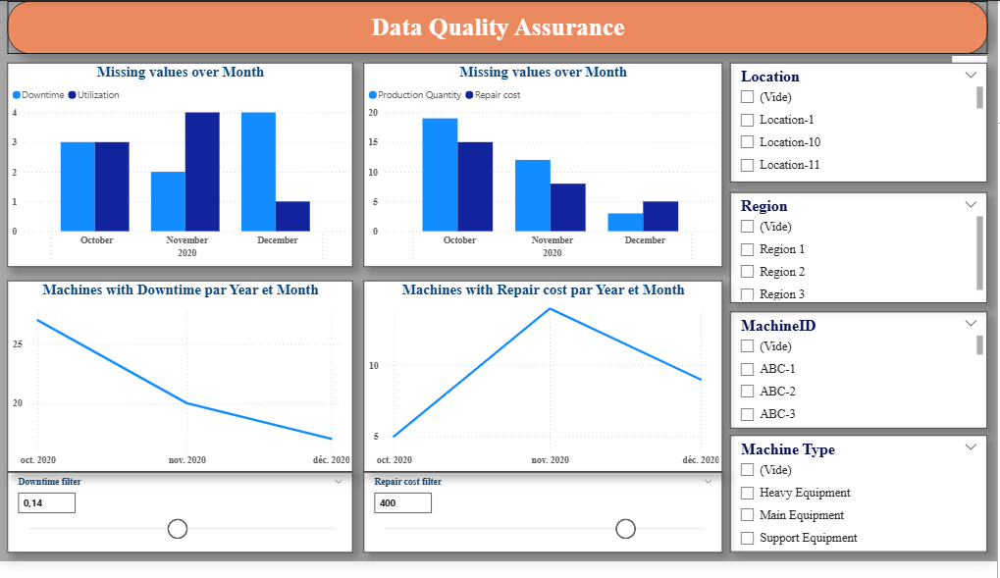
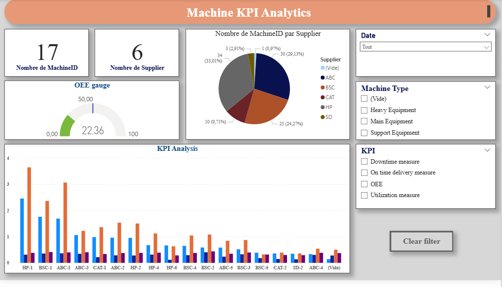
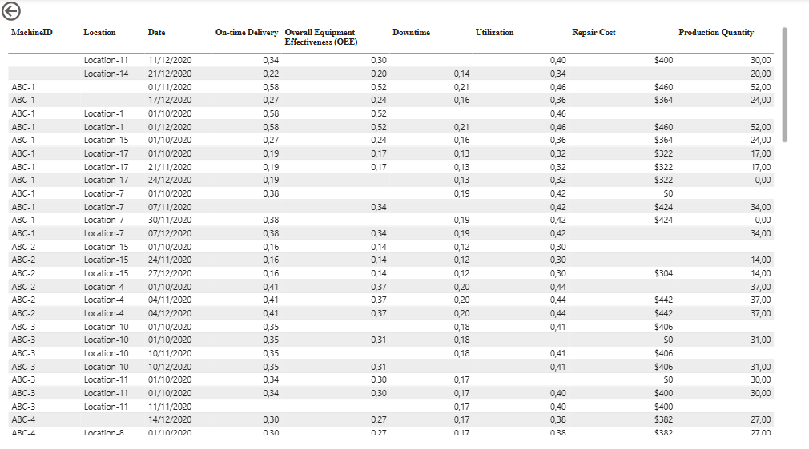
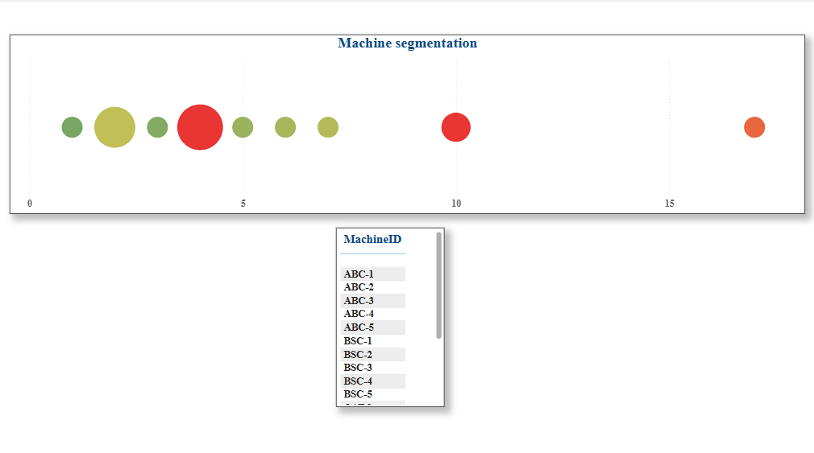

<div align="center">

# 📊 KPI Analysis Dashboard — Power BI

### Industrial KPI Analysis for Machine Performance & Production Quality

[](https://powerbi.microsoft.com/)
[](https://learn.microsoft.com/dax)
[]()
[]()

*A Power BI dashboard for analyzing Key Performance Indicators (KPIs) of industrial equipment and production lines.*

</div>

---

## 📑 Table of Contents

- [Project Context](#-project-context)
- [Dashboard Preview](#-dashboard-preview)
- [Professional Background](#-professional-background)
- [Technologies Used](#️-technologies-used)
- [Key Performance Indicators](#-key-performance-indicators)
- [Key Features](#-key-features)
- [Architecture](#️-architecture)
- [Installation & Usage](#-installation--usage)
- [Repository Structure](#-repository-structure)
- [Future Enhancements](#-future-enhancements)
- [Prerequisites](#-prerequisites)
- [Target Users](#-target-users)
- [Author](#-author)

---

## 🎯 Project Context

This dashboard was developed as part of my industrial data analysis experience, bringing together best practices from my work in manufacturing and production environments.

---

## 📸 Dashboard Preview

<div align="center">

### Data Quality Overview


### Machine Analytics


### Machine Details


### Machine Segments


</div>

> 💡 **Note:** Screenshots are stored in the [`images/`](images) folder of this repository.

---

## 🏭 Professional Background

This project reflects my experience in industrial data analysis across major organizations:

| Organization | Role | Duration |
|---|---|---|
| **General Dynamics Land Systems** | Technical and production data analysis | 11 years |
| **Leonardo DRS** | Industrial performance indicators & operational reporting | 7.5 years |
| **AUF** | Institutional project management dashboards with Power BI | Current |

---

## 🛠️ Technologies Used

- **Power BI** — Data modeling and visualization
- **DAX** — Advanced calculations and measures
- **Data Modeling** — Star schema design
- **Excel** — Data sources and KPI reference list

---

## 📈 Key Performance Indicators

- ⚙️ Machine availability rate
- 🔧 Operational performance
- ✅ Production quality rate
- 📊 Overall Equipment Effectiveness (OEE)
- 📉 Overall Efficiency Ratio (OER)
- ⏱️ Downtime analysis
- 🏭 Production throughput

---

## 📊 Key Features

- 🔍 Dynamic filters by machine, period, and product
- 🔔 Performance alerts and notifications
- 📈 Trend analysis with forecasting
- 🖱️ Interactive charts and visuals
- 📤 Report export (PDF/Excel)
- 🔗 Drill-through capabilities
- 📱 Mobile-optimized views

---

## 🏗️ Architecture

- **Data Model** — Star schema with dimension and fact tables
- **Measures** — Optimized DAX calculations
- **Security** — Row Level Security (RLS) implemented
- **Performance** — Optimized for large datasets

---

## 🔧 Installation & Usage

1. Open the `KPI Analysis.pbix` file with **Power BI Desktop**
2. Verify data sources (Excel file included in the repository)
3. Refresh data if needed
4. Explore interactive visualizations
5. Apply filters for specific analysis

---

## 📁 Repository Structure

```
KPI-Analysis/
├── KPI Analysis.pbix     # Power BI dashboard file
├── V4 KPI List.xlsx      # KPI reference data
├── images/                # Dashboard screenshots
│   ├── data_quality.PNG
│   ├── machine_analytics.PNG
│   ├── machine_details.PNG
│   └── machine_segments.PNG
├── README.md              # Project documentation
└── CHANGELOG.md           # Version history
```

---

## 🚀 Future Enhancements

- Integration with Azure SQL Database
- Real-time data streaming
- Advanced predictive analytics
- Automated report distribution
- Custom visual development

---

## 📋 Prerequisites

- Power BI Desktop (latest version recommended)
- Microsoft Excel (for data source modifications)
- Windows OS (Power BI Desktop requirement)

---

## 👥 Target Users

- 🏭 Production Managers
- 📊 Operations Directors
- ✅ Quality Assurance Teams
- 🔧 Maintenance Engineers
- 💼 Executive Leadership

---

## 👤 Author

<div align="center">

### **Hicham Errihani**
*Data Analyst & BI Expert*

[](mailto:errihanihicham1@gmail.com)
[](https://www.linkedin.com/in/hicham-errihani-815755266)
[](https://x.com/ErrihaniHi79506)
[](https://instagram.com/hichamerr)

</div>

### 📝 Certifications

- Microsoft Azure Certified
- AWS Certified
- Databricks Certified
- Oracle Certified
- IBM Certified
- Google Certified

### 🎓 Education

- Master in Computer Engineering & Big Data

---

<div align="center">

💼 **Industrial Data Analysis Portfolio**

⭐ *If you found this project useful, consider giving it a star!*

</div>
